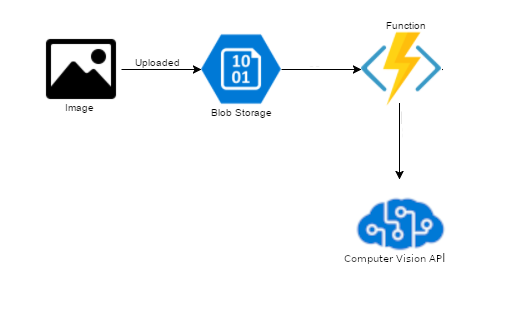

# Część praktyczna

### WSTĘP
Projekt zakładał sprawdzenie czy samochód z daną rejestracją może wjechać na parking czyli np. ma wykupione miejsce w bloku, czy kupił bilet na autostradę. 

Poczatkowo próbowałam znaleźć film, z którego mogłabym wyszukiwać samochody i zczytywać rejestrację. Jednakże nigdzie nie znalazłam dobrej jakości filmu, z którego możnaby zczytac dane informację. Więc stwierdziłam, że zajmę się mniejszym zagadnieniem, czyli zczytam sam napis z rejestracji i porównam z danymi w "bazie" samochodów, które mają ten bilet czy mogą wjechać na dany parking. 

### KROKI

1. Znalezienie zdjęć i zgranie do bloba
    
2. Użycie serwisu Computer Vision API do zczytania tekstu drukowanego ze zdjecia

3. Przetworzenie wyszukanego tekstu do formatu, który odpowiadałby danym w "bazie"

4. Porównanie i przetwarzanie tekstu- Function App

5. Wypisanie na stronie czy dane auto ma dostęp. 

### ARCHITEKTURA:

### KOD 

[computer_vision_code - link do części w tym repo](https://github.com/MagdalenaKuna/AI-on-Microsoft-Azure-MK/tree/main/COMPUTER%20VISION/computer_vision_code)

### VIDEO

link

Video na YouTube (public/unlisted) z demo / pitch demo waszego bota (około 3 do 5 minut) i Waszym komentarzem:
    Jaki problem rozwiązuje Wasze rozwiązanie (scenariusz)
    Na czym polega rozwiązanie i jak działa
